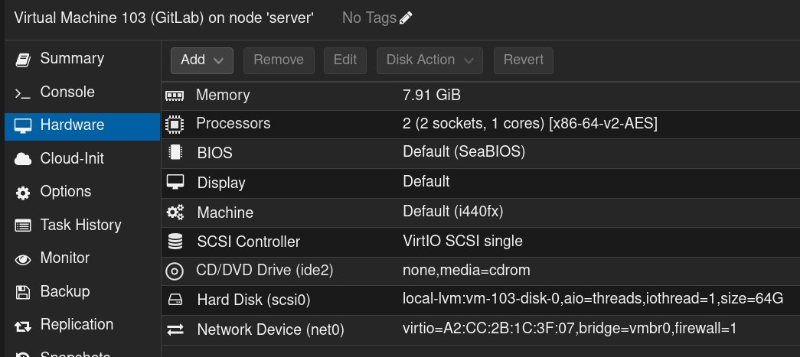
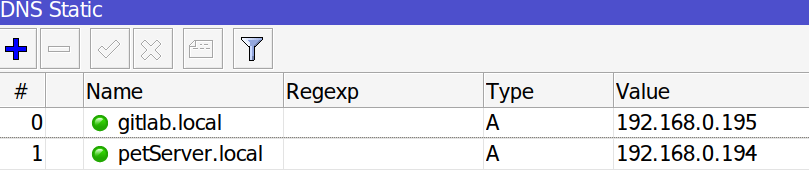
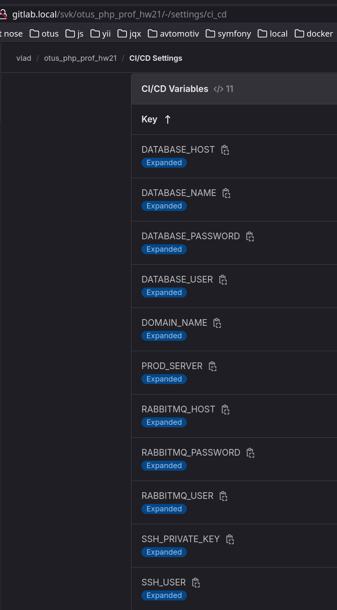
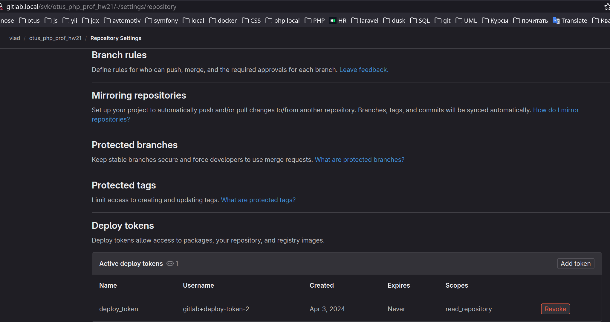
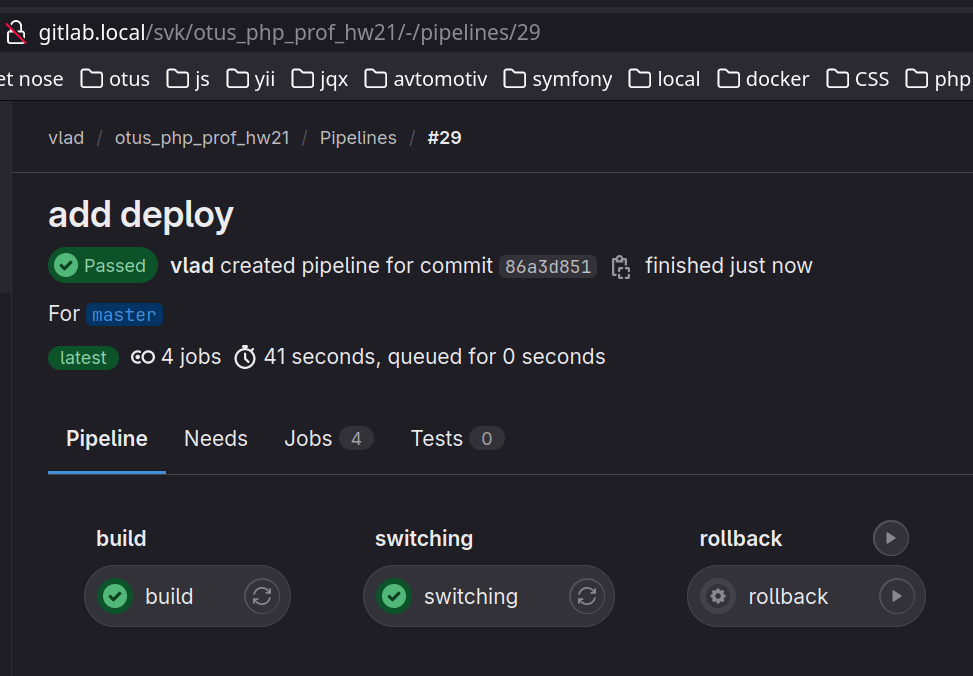
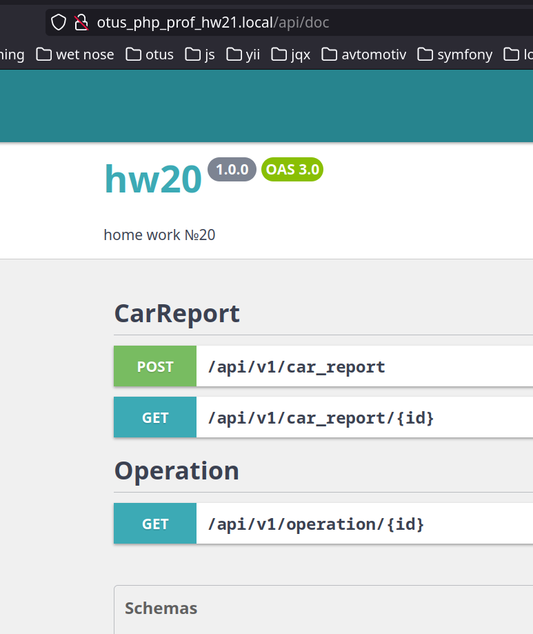
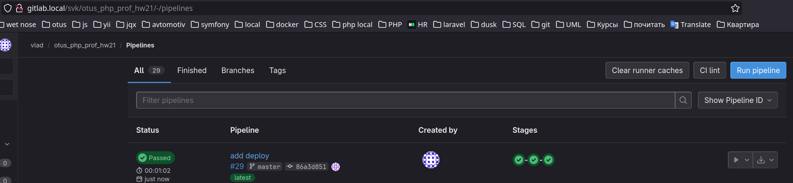

# Домашнее задание
Скрипт деплоя

## Цель:
Научиться доставлять приложение до указанной среды.

## Описание/Пошаговая инструкция выполнения домашнего задания:
Используя выбранный инструмент автоматического деплоя, необходимо реализовать автоматическую выкатку написанного ранее мини-приложения на собственный виртуальный сервер.

## Критерии оценки:
1. Автоматическая доставка на любую среду;
2. Доставка без downtime;
3. Желательно организовать отдельный закрытый репозиторий настроек, из которого формируются файлы конфигурации для выбранной среды в момент деплоя.

# Об окружении
1. Поднял две VM(ubuntu 22.04) на домашнем сервере:
   - gitlab 
 
   - petServer 
 
2. Задал dns имена на роутере для удобной работы с VM 
 

Проект для развертывания был взят из ДЗ №20(hm20)
Создан репозиторий otus_php_prof_hw21 с основной веткой master
Заданы переменный окружения в проекте gitlab 
Добавлен токен для деплоя 

## Проверка работы
1. Пушем в master
2. Ждем пока отработает pipeline 

3. Идем в OpenAPI `/api/doc` приложения и проверяем его работу 

4. При необходимости можно откатиться на предыдущею версию 
 
