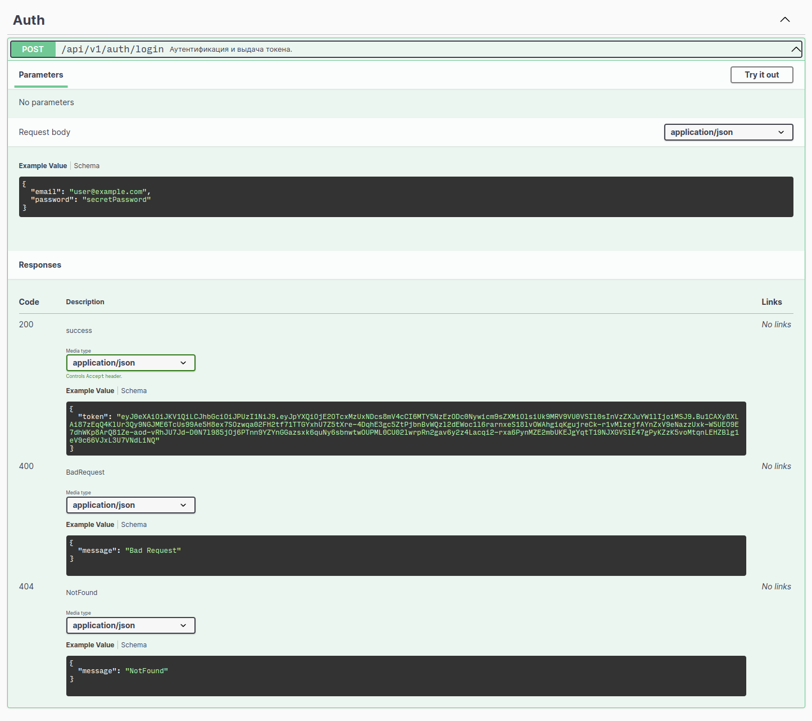
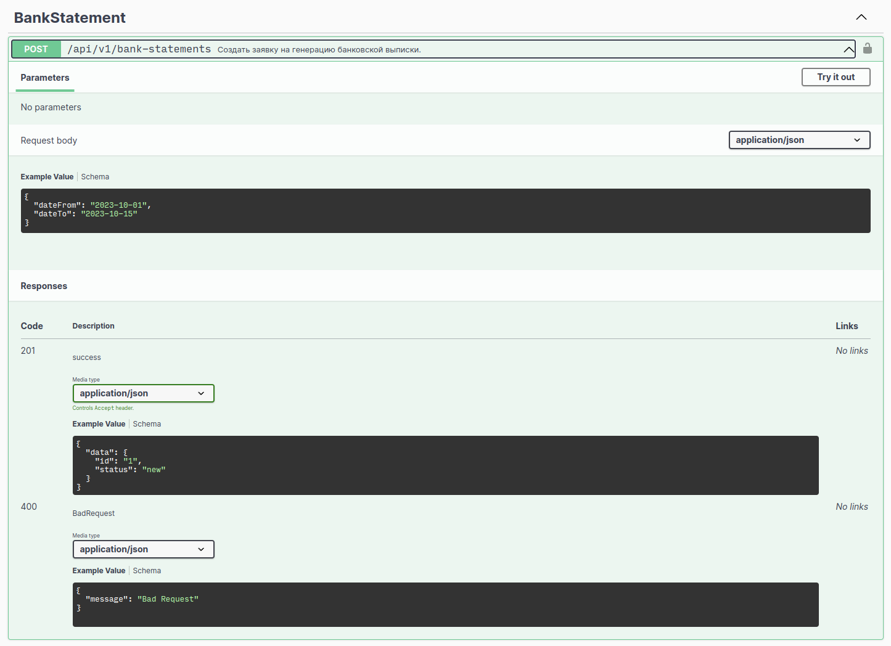
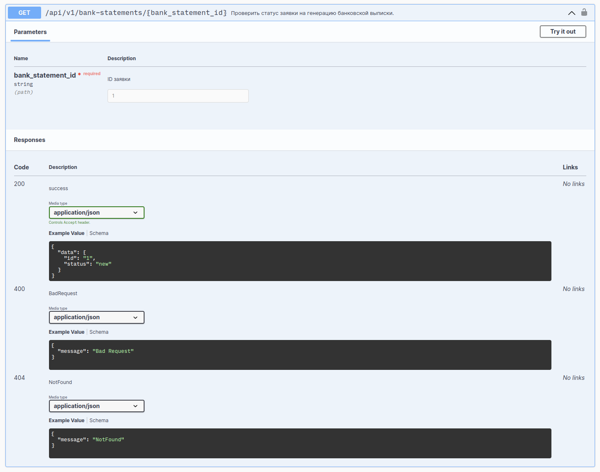
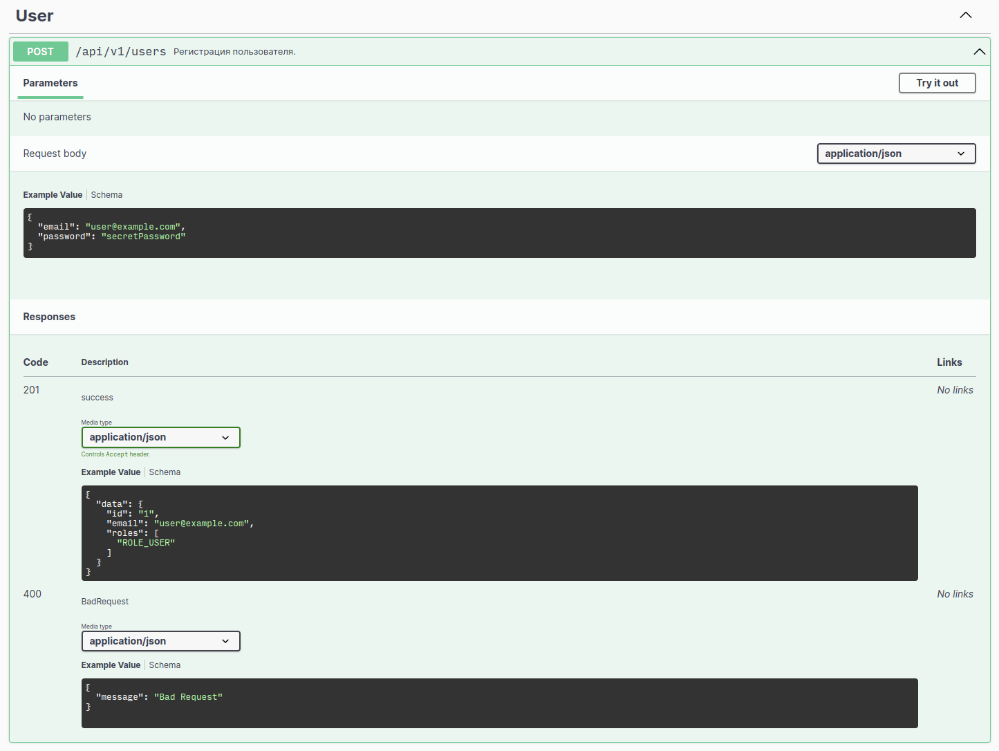

# Домашняя работа №20

## Запуск

```shell
cp .env.example .env
cp app/.env app/.env.local
# отредактировать настройки MAIL_SENDER и MAILER_DSN в app/.env.local для отправки писем
docker-compose up -d --build
docker exec -it imitronov_hw20_app bin/console lexik:jwt:generate-keypair
docker exec -it imitronov_hw20_app bin/console app:consume
```

## Документация:

Доступна по адресу: http://localhost:3939/api/doc.json <br />
Для просмотра можно воспользоваться [расширением для Google Chrome](https://chrome.google.com/webstore/detail/swagger-ui/liacakmdhalagfjlfdofigfoiocghoej).




