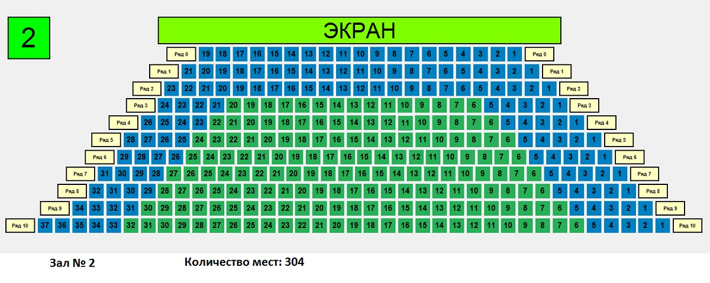

# PHP_2023

https://otus.ru/lessons/razrabotchik-php/?utm_source=github&utm_medium=free&utm_campaign=otus

# Домашнее задание - Проектирование БД

## Цель:
- Закрепить навыки проектирования баз данных;
- Научиться правильно нормализовать хранение данных;
- Научиться описывать БД через DDL.

## Описание/инструкция выполнения домашнего задания:
- Кинотеатр имеет несколько залов, в каждом зале идет несколько разных сеансов, клиенты могут купить билеты на сеансы
- Спроектировать базу данных для управления кинотеатром
- Задокументировать с помощью логической модели
- Написать DDL скрипты
- Написать SQL для нахождения самого прибыльного фильма
- Обратите внимание на то, что мы проектируем систему из реального мира. Попробуйте посмотреть на то, как устроена система покупки билета в кинотеатре.
- Все ли сеансы и места стоят одинаково?
- Как может выглядеть схема зала?

