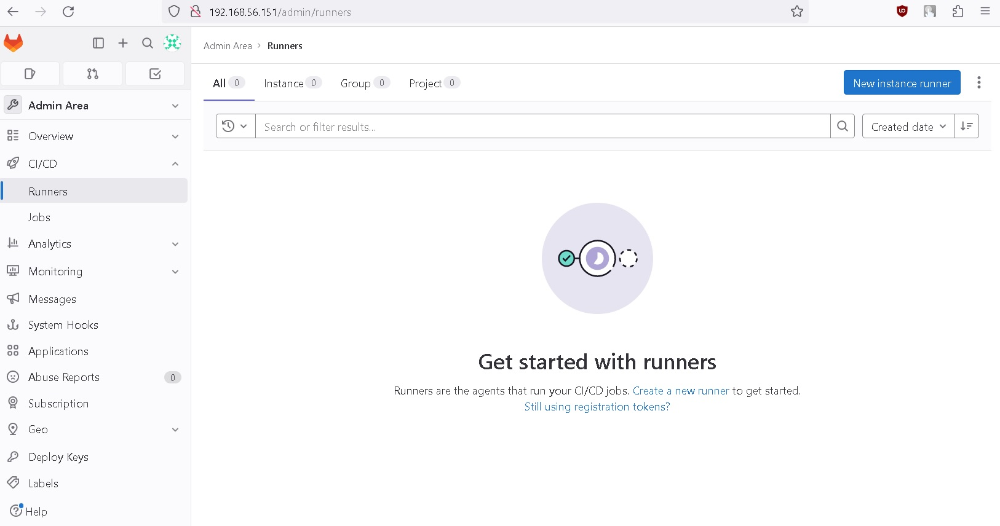
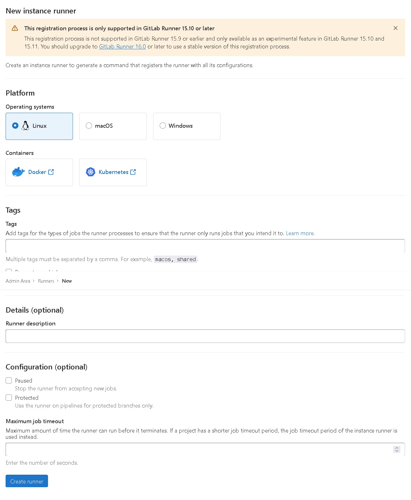
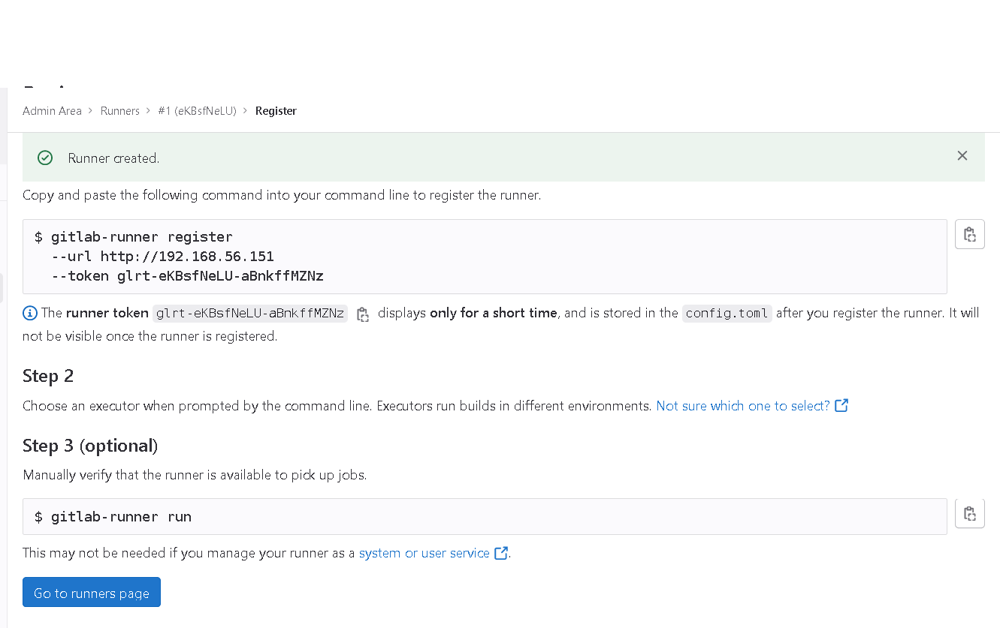
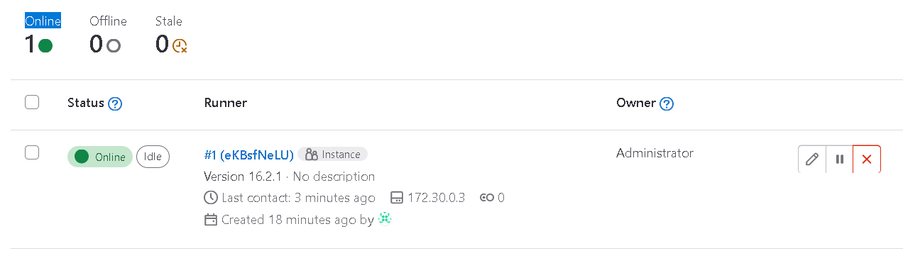
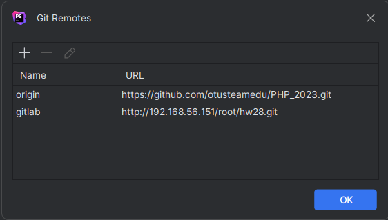
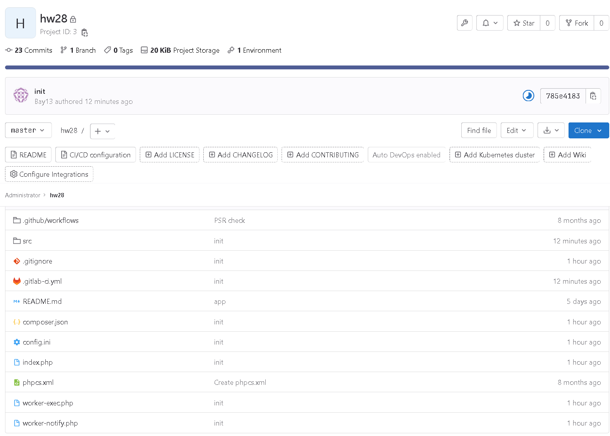
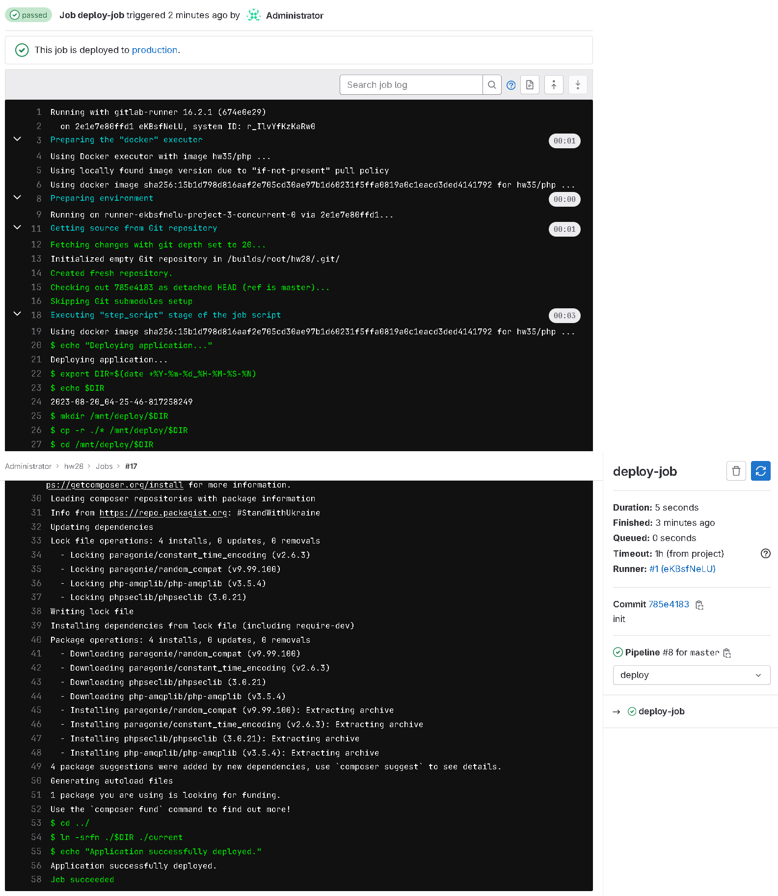
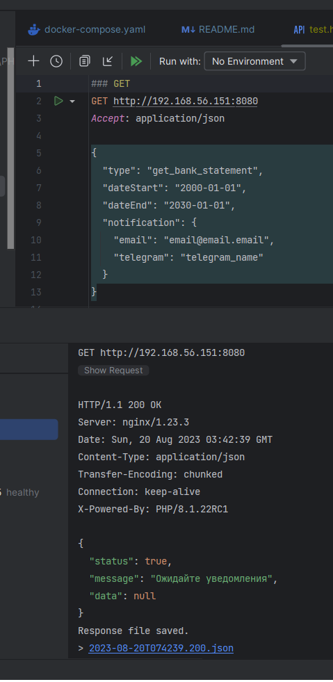

# PHP_2023_HW35

1. Настраеиваем `docker-compose.yaml`:
   1. Для сервиса `gitlab`:
      1. `external_url 'http://192.168.56.151'` - адрес по которому будет доступен `gitlab`
   1. Для сервиса `gitlab-runner`:
      1. `./docker/volumes/deploy:/mnt/deploy` - путь куда будет происходить развертывание.
      1.  На `./docker/volumes/deploy` устанавливаем права 
         `chmod g+w,o+w docker/volumes/deploy/`
1. Собираем image для `php` - `docker-compose build php`. Получаем имя образа - `hw35/php`.
1. Запускаем `gitlab` и `gitlab-runner` - `docker-compose up gitlab gitlab-runner`.
1. После запуска получаем пароль для пользователя `root` - `docker-compose exec gitlab grep 'Password:' /etc/gitlab/initial_root_password`
   В конкретном случае - `NSMvEE3yt3x69a/sPnP3cRYiko0NScHY0HFW6p1Jjfc=`
1. В интерфейсе `gitlab`, переходим в раздел `Admin Area`->`CI/CD`->`Runners`, выбираем `New Instance runner`
   
1. Создаем новый `runner`. Выбираем Ос - `Linux`. Отмечаем `Run untagged jobs`
   
   В результате получаем токен для регистрации, в данном случае `glrt-eKBsfNeLU-aBnkffMZNz`
   
1. Настраиваем файл `./docker/volumes/gitlab/config/config.template.toml`:
   1. `"/home/user/hw/hw35/deploy:/mnt/deploy:rw"` - указываем полный путь к папке для развертывания.
1. Регистрируем `runner`: 
   `docker-compose exec gitlab-runner gitlab-runner register --url http://gitlab --token glrt-eKBsfNeLU-aBnkffMZNz --template-config /etc/gitlab-runner/config.template.toml --executor docker --non-interactive`,
   где `-token` - токен полученный ранее
1. В интерфейсе `gitlab`, переходим в раздел `Admin Area`->`CI/CD`->`Runners`, ранее мозданный `runner` должен быть в статусе `Online`
   
1. В интерфейсе `gitlab`, создем новый репозиторий `hw28` (`http://192.168.56.151/root/hw28.git`), 
   возмем за основу проект [HW28](https://github.com/otusteamedu/PHP_2023/tree/APorivaev/hw28), 
   его отредактированная версия [HW35-app](https://github.com/otusteamedu/PHP_2023/tree/APorivaev/hw35-app).
1. Скачиваем проект с `github.com`, добавляем к нему репозиторий с `gitlab`
   
    и делаем `push` на сервер `gitlab`, Получем:
   
   
1. После успешного завершения `deploy-job` в `./docker/volumes/deploy` должна появиться новая 
   папка и ссылка `current` на нее. 
   ```shell
   client-1 /home/user/hw/hw35 # ls -alh docker/volumes/deploy/
   total 3.0K
   drwxrwxrwx 3 root root  1.0K Aug 20 07:25 .
   drwxr-xr-x 4 user users 1.0K Aug 19 23:14 ..
   drwxr-xr-x 4 user  1000 1.0K Aug 20 07:25 2023-08-20_03-25-22-887697965
   lrwxrwxrwx 1 user  1000   29 Aug 20 07:25 current -> 2023-08-20_03-25-22-887697965
   ```
1. В `docker-compose.yaml` для сервисов `php` и `nginx` указываем
   ```yaml
       volumes:
          - ./docker/volumes/deploy/current:/var/www/app
   ```
1. Запускаем `php`, `nginx` и `rabbitmq` - `docker-compose up php nginx rabbitmq`.
1. Проверяем работу приложения:
   