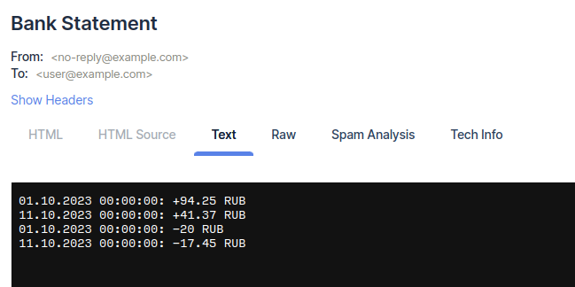

# Домашняя работа №19

## Запуск

```shell
cp .env.example .env
cp app/.env app/.env.local
# отредактировать настройки MAIL_SENDER и MAILER_DSN в app/.env.local для отправки писем
docker-compose up -d --build
docker exec -it imitronov_hw19_app bin/console app:consume
```

## Запрос для генерации выписки:

```
POST /api/v1/bank-statements

{
    "email": "user@example.com",
    "dateFrom": "2023-10-01 00:00:00",
    "dateTo": "2023-10-11 00:00:00"
}
```

## Пример вывода в консоль:

```
Handling: O:51:"App\Application\Command\ProcessBankStatementCommand":3:{s:5:"email";O:28:"App\Domain\ValueObject\Email":1:{s:35:"App\Domain\ValueObject\Emailvalue";s:16:"user@example.com";}s:8:"dateFrom";O:17:"DateTimeImmutable":3:{s:4:"date";s:26:"2023-10-01 00:00:00.000000";s:13:"timezone_type";i:3;s:8:"timezone";s:3:"UTC";}s:6:"dateTo";O:17:"DateTimeImmutable":3:{s:4:"date";s:26:"2023-10-11 00:00:00.000000";s:13:"timezone_type";i:3;s:8:"timezone";s:3:"UTC";}}.
Handled: App\Application\Command\ProcessBankStatementCommand(user@example.com, 2023-10-01T00:00:00+00:00, 2023-10-11T00:00:00+00:00).
```

## Пример отправленного письма:


