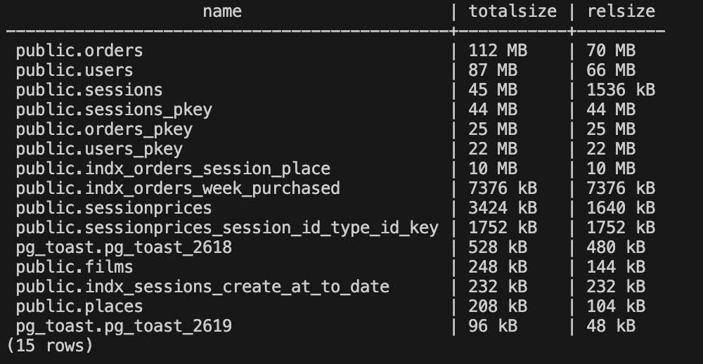
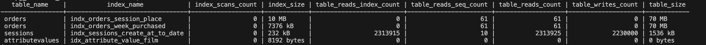

## Развертывания БД

1. Выбрать БД и выполнить код из файла [scheme_DDL.sql](./app/scheme_DDL.sql)
2. Создать необходимые функции из файла [function.sql](./app/function.sql)
3. Заполнить схему зала из файла [cinema_data.sql](./app/cinema_data.sql)
4. Заполнить тестовыми данными из файла [10000_data.sql](./app/10000_data.sql)
5. Заполнить тестовыми данными из файла [1000000_data.sql](./app/1000000_data.sql)

## Оптимизация 

### Выбор всех фильмов на сегодня

* Запрос 

```SQL
    SELECT 
        films.name as name, halls.name as hall, to_char(sessions.start_at, 'HH24:MI')
    FROM Sessions
    LEFT JOIN films ON films.id = sessions.film_id
    LEFT JOIN halls ON halls.id = sessions.hall_id
    WHERE DATE(sessions.start_at) = current_date
    ORDER BY sessions.start_at;
```

* EXPLAIN до оптимизации

```BASH
      QUERY PLAN                                    
---------------------------------------------------------------------------------
  Sort  (cost=767.58..767.96 rows=150 width=291) (actual time=13.022..13.114 rows=781 loops=1)
   Sort Key: sessions.start_at
   Sort Method: quicksort  Memory: 125kB
   ->  Hash Left Join  (cost=44.00..762.16 rows=150 width=291) (actual time=0.498..12.213 rows=781 loops=1)
         Hash Cond: (sessions.hall_id = halls.id)
         ->  Hash Left Join  (cost=26.80..744.19 rows=150 width=45) (actual time=0.376..11.424 rows=781 loops=1)
               Hash Cond: (sessions.film_id = films.id)
               ->  Seq Scan on sessions  (cost=0.00..717.00 rows=150 width=16) (actual time=0.016..10.827 rows=781 loops=1)
                     Filter: (date(start_at) = CURRENT_DATE)
                     Rows Removed by Filter: 29219
               ->  Hash  (cost=21.91..21.91 rows=391 width=37) (actual time=0.345..0.351 rows=400 loops=1)
                     Buckets: 1024  Batches: 1  Memory Usage: 36kB
                     ->  Seq Scan on films  (cost=0.00..21.91 rows=391 width=37) (actual time=0.014..0.152 rows=400 loops=1)
         ->  Hash  (cost=13.20..13.20 rows=320 width=222) (actual time=0.064..0.065 rows=3 loops=1)
               Buckets: 1024  Batches: 1  Memory Usage: 9kB
               ->  Seq Scan on halls  (cost=0.00..13.20 rows=320 width=222) (actual time=0.005..0.007 rows=3 loops=1)
 Planning Time: 0.418 ms
 Execution Time: 13.475 ms
```

* Добавил INDEX на основе выражений

```SQL
    CREATE INDEX indx_sessions_create_at_to_date ON sessions (DATE(sessions.start_at));
```

* EXPLAIN после добовления index
```bash
      QUERY PLAN                                                    
-------------------------------------------------------------------------------------------------
  Sort  (cost=912.87..912.99 rows=47 width=291) (actual time=10.897..10.924 rows=138 loops=1)
   Sort Key: sessions.start_at
   Sort Method: quicksort  Memory: 43kB
   ->  Hash Left Join  (cost=44.20..911.56 rows=47 width=291) (actual time=0.657..10.645 rows=138 loops=1)
         Hash Cond: (sessions.hall_id = halls.id)
         ->  Hash Left Join  (cost=27.00..894.12 rows=47 width=45) (actual time=0.557..10.321 rows=138 loops=1)
               Hash Cond: (sessions.film_id = films.id)
               ->  Seq Scan on sessions  (cost=0.00..867.00 rows=47 width=16) (actual time=0.106..9.746 rows=138 loops=1)
                     Filter: ((start_at > CURRENT_TIMESTAMP) AND (date(start_at) = CURRENT_DATE))
                     Rows Removed by Filter: 29862
               ->  Hash  (cost=22.00..22.00 rows=400 width=37) (actual time=0.406..0.407 rows=400 loops=1)
                     Buckets: 1024  Batches: 1  Memory Usage: 36kB
                     ->  Seq Scan on films  (cost=0.00..22.00 rows=400 width=37) (actual time=0.013..0.255 rows=400 loops=1)
         ->  Hash  (cost=13.20..13.20 rows=320 width=222) (actual time=0.023..0.025 rows=3 loops=1)
               Buckets: 1024  Batches: 1  Memory Usage: 9kB
               ->  Seq Scan on halls  (cost=0.00..13.20 rows=320 width=222) (actual time=0.009..0.010 rows=3 loops=1)
 Planning Time: 1.578 ms
 Execution Time: 11.267 ms
```

---

### Подсчёт проданных билетов за неделю

* Запрос 

```SQL
   SELECT COUNT(*) FROM 
        orders
    WHERE 
        DATE(created_at) >= DATE( CURRENT_TIMESTAMP - '7 days'::interval ) 
        and DATE(created_at) < CURRENT_DATE 
        and status = 'purchased';
```

* EXPLAIN до оптимизации
```bash
    QUERY PLAN                                                                                     
----------------------------------------------------------------------------------------------------------------
 Finalize Aggregate  (cost=24627.10..24627.11 rows=1 width=8) (actual time=291.816..293.043 rows=1 loops=1)
   ->  Gather  (cost=24626.89..24627.10 rows=2 width=8) (actual time=291.664..293.035 rows=3 loops=1)
         Workers Planned: 2
         Workers Launched: 2
         ->  Partial Aggregate  (cost=23626.89..23626.90 rows=1 width=8) (actual time=278.492..278.492 rows=1 loops=3)
               ->  Parallel Seq Scan on orders  (cost=0.00..23625.00 rows=756 width=0) (actual time=0.403..276.828 rows=28156 loops=3)
                     Filter: ((status = 'purchased'::status_order) AND (date(created_at) < CURRENT_DATE) AND (date(created_at) >= date((CURRENT_TIMESTAMP - '7 days'::interval))))
                     Rows Removed by Filter: 331844
 Planning Time: 0.570 ms
 Execution Time: 294.416 ms
```

* Добавил состовной INDEX с выражением
```sql
    CREATE INDEX indx_orders_week_purchased ON orders (status, date(created_at));
```

* EXPLAIN после добовления index
```bash
    QUERY PLAN                                                                                    
-----------------------------------------------------------------------------------------------
  Aggregate  (cost=4573.57..4573.58 rows=1 width=8) (actual time=34.351..34.353 rows=1 loops=1)
   ->  Bitmap Heap Scan on orders  (cost=31.58..4569.03 rows=1815 width=0) (actual time=9.011..25.531 rows=84469 loops=1)
         Recheck Cond: ((status = 'purchased'::status_order) AND (date(created_at) >= date((CURRENT_TIMESTAMP - '7 days'::interval))) AND (date(created_at) < CURRENT_DATE))
         Heap Blocks: exact=9000
         ->  Bitmap Index Scan on indx_orders_week_purchased  (cost=0.00..31.12 rows=1815 width=0) (actual time=7.548..7.549 rows=84469 loops=1)
               Index Cond: ((status = 'purchased'::status_order) AND (date(created_at) >= date((CURRENT_TIMESTAMP - '7 days'::interval))) AND (date(created_at) < CURRENT_DATE))
 Planning Time: 1.212 ms
 Execution Time: 34.688 ms
```


---

###  Формирование афиши (фильмы, которые показывают сегодня)

* Запрос 

```SQL
    SELECT 
        films.name as name, halls.name as hall, to_char(sessions.start_at, 'HH24:MI')
    FROM Sessions
    LEFT JOIN films ON films.id = sessions.film_id
    LEFT JOIN halls ON halls.id = sessions.hall_id
    WHERE 
        DATE(sessions.start_at) = CURRENT_DATE
        AND sessions.start_at > CURRENT_TIMESTAMP
    ORDER BY sessions.start_at;
```

* EXPLAIN

```bash
Sort  (cost=912.87..912.99 rows=47 width=291) (actual time=6.872..6.890 rows=138 loops=1)
   Sort Key: sessions.start_at
   Sort Method: quicksort  Memory: 43kB
   ->  Hash Left Join  (cost=44.20..911.56 rows=47 width=291) (actual time=0.708..6.739 rows=138 loops=1)
         Hash Cond: (sessions.hall_id = halls.id)
         ->  Hash Left Join  (cost=27.00..894.12 rows=47 width=45) (actual time=0.581..6.526 rows=138 loops=1)
               Hash Cond: (sessions.film_id = films.id)
               ->  Seq Scan on sessions  (cost=0.00..867.00 rows=47 width=16) (actual time=0.098..6.001 rows=138 loops=1)
                     Filter: ((start_at > CURRENT_TIMESTAMP) AND (date(start_at) = CURRENT_DATE))
                     Rows Removed by Filter: 29862
               ->  Hash  (cost=22.00..22.00 rows=400 width=37) (actual time=0.412..0.413 rows=400 loops=1)
                     Buckets: 1024  Batches: 1  Memory Usage: 36kB
                     ->  Seq Scan on films  (cost=0.00..22.00 rows=400 width=37) (actual time=0.012..0.272 rows=400 loops=1)
         ->  Hash  (cost=13.20..13.20 rows=320 width=222) (actual time=0.020..0.021 rows=3 loops=1)
               Buckets: 1024  Batches: 1  Memory Usage: 9kB
               ->  Seq Scan on halls  (cost=0.00..13.20 rows=320 width=222) (actual time=0.011..0.012 rows=3 loops=1)
 Planning Time: 1.374 ms
 Execution Time: 7.211 ms
```

* Планировщик использует ранее добавленный INDEX indx_sessions_create_at_to_date

* EXPLAIN 
```bash
    Sort  (cost=243.67..243.79 rows=47 width=291) (actual time=1.599..1.613 rows=137 loops=1)
   Sort Key: sessions.start_at
   Sort Method: quicksort  Memory: 43kB
   ->  Hash Left Join  (cost=49.63..242.37 rows=47 width=291) (actual time=0.510..1.469 rows=137 loops=1)
         Hash Cond: (sessions.hall_id = halls.id)
         ->  Hash Left Join  (cost=32.43..224.93 rows=47 width=45) (actual time=0.430..1.261 rows=137 loops=1)
               Hash Cond: (sessions.film_id = films.id)
               ->  Bitmap Heap Scan on sessions  (cost=5.43..197.80 rows=47 width=16) (actual time=0.114..0.891 rows=137 loops=1)
                     Recheck Cond: (date(start_at) = CURRENT_DATE)
                     Filter: (start_at > CURRENT_TIMESTAMP)
                     Rows Removed by Filter: 644
                     Heap Blocks: exact=186
                     ->  Bitmap Index Scan on indx_sessions_create_at_to_date  (cost=0.00..5.42 rows=150 width=0) (actual time=0.073..0.073 rows=781 loops=1)
                           Index Cond: (date(start_at) = CURRENT_DATE)
               ->  Hash  (cost=22.00..22.00 rows=400 width=37) (actual time=0.296..0.297 rows=400 loops=1)
                     Buckets: 1024  Batches: 1  Memory Usage: 36kB
                     ->  Seq Scan on films  (cost=0.00..22.00 rows=400 width=37) (actual time=0.008..0.160 rows=400 loops=1)
         ->  Hash  (cost=13.20..13.20 rows=320 width=222) (actual time=0.061..0.061 rows=3 loops=1)
               Buckets: 1024  Batches: 1  Memory Usage: 9kB
               ->  Seq Scan on halls  (cost=0.00..13.20 rows=320 width=222) (actual time=0.003..0.005 rows=3 loops=1)
 Planning Time: 0.549 ms
 Execution Time: 1.853 ms
```

---

### Поиск 3 самых прибыльных фильмов за неделю

* Запрос 

```SQL
   SELECT 
        films.name, max(orders.price) as total 
    FROM 
        orders
    LEFT JOIN sessions ON sessions.id = orders.session_id	
    LEFT JOIN films ON films.id = sessions.film_id	
    WHERE 
        DATE(created_at) >= DATE( CURRENT_TIMESTAMP - '7 days'::interval ) 
        and DATE(created_at) < CURRENT_DATE 
        and status = 'purchased'
    GROUP BY films.id
    ORDER BY total DESC LIMIT 3;
```

* EXPLAIN до оптимизации
```bash
    QUERY PLAN                                                                                                
-------------------------------------------------------------------------------------------
 Limit  (cost=25674.34..25674.35 rows=3 width=69) (actual time=130.058..131.303 rows=3 loops=1)
   ->  Sort  (cost=25674.34..25675.34 rows=400 width=69) (actual time=130.056..131.300 rows=3 loops=1)
         Sort Key: (max(orders.price)) DESC
         Sort Method: top-N heapsort  Memory: 25kB
         ->  Finalize GroupAggregate  (cost=25559.16..25669.17 rows=400 width=69) (actual time=125.123..131.167 rows=369 loops=1)
               Group Key: films.id
               ->  Gather Merge  (cost=25559.16..25661.17 rows=800 width=69) (actual time=125.090..131.022 rows=1107 loops=1)
                     Workers Planned: 2
                     Workers Launched: 2
                     ->  Partial GroupAggregate  (cost=24559.14..24568.81 rows=400 width=69) (actual time=114.341..118.368 rows=369 loops=3)
                           Group Key: films.id
                           ->  Sort  (cost=24559.14..24561.03 rows=756 width=43) (actual time=114.312..116.079 rows=28156 loops=3)
                                 Sort Key: films.id
                                 Sort Method: quicksort  Memory: 3876kB
                                 Worker 0:  Sort Method: quicksort  Memory: 3251kB
                                 Worker 1:  Sort Method: quicksort  Memory: 3497kB
                                 ->  Hash Left Join  (cost=894.00..24522.99 rows=756 width=43) (actual time=17.810..101.183 rows=28156 loops=3)
                                       Hash Cond: (sessions.film_id = films.id)
                                       ->  Hash Left Join  (cost=867.00..24493.98 rows=756 width=10) (actual time=17.332..95.308 rows=28156 loops=3)
                                             Hash Cond: (orders.session_id = sessions.id)
                                             ->  Parallel Seq Scan on orders  (cost=0.00..23625.00 rows=756 width=10) (actual time=0.071..67.344 rows=28156 loops=3)
                                                   Filter: ((status = 'purchased'::status_order) AND (date(created_at) < CURRENT_DATE) AND (date(created_at) >= date((CURRENT_TIMESTAMP - '7 days'::interval))))
                                                   Rows Removed by Filter: 331844
                                             ->  Hash  (cost=492.00..492.00 rows=30000 width=8) (actual time=16.773..16.774 rows=30000 loops=3)
                                                   Buckets: 32768  Batches: 1  Memory Usage: 1428kB
                                                   ->  Seq Scan on sessions  (cost=0.00..492.00 rows=30000 width=8) (actual time=0.037..5.816 rows=30000 loops=3)
                                       ->  Hash  (cost=22.00..22.00 rows=400 width=37) (actual time=0.411..0.411 rows=400 loops=3)
                                             Buckets: 1024  Batches: 1  Memory Usage: 36kB
                                             ->  Seq Scan on films  (cost=0.00..22.00 rows=400 width=37) (actual time=0.042..0.244 rows=400 loops=3)
 Planning Time: 1.424 ms
 Execution Time: 131.996 ms
```

* INDEX
```SQL
      CREATE INDEX indx_orders_tree_films ON orders (DATE(created_at), status) WHERE status = 'purchased';
```


* EXPLAIN после добовления index
```bash
    QUERY PLAN                                                                                    
-----------------------------------------------------------------------------------------------
 Limit  (cost=5486.32..5486.32 rows=3 width=69) (actual time=99.037..99.040 rows=3 loops=1)
   ->  Sort  (cost=5486.32..5487.32 rows=400 width=69) (actual time=99.035..99.038 rows=3 loops=1)
         Sort Key: (max(orders.price)) DESC
         Sort Method: top-N heapsort  Memory: 25kB
         ->  HashAggregate  (cost=5477.15..5481.15 rows=400 width=69) (actual time=98.936..98.973 rows=369 loops=1)
               Group Key: films.id
               Batches: 1  Memory Usage: 93kB
               ->  Hash Left Join  (cost=921.04..5468.07 rows=1815 width=43) (actual time=24.132..82.868 rows=83781 loops=1)
                     Hash Cond: (sessions.film_id = films.id)
                     ->  Hash Left Join  (cost=894.04..5436.25 rows=1815 width=10) (actual time=22.657..68.047 rows=83781 loops=1)
                           Hash Cond: (orders.session_id = sessions.id)
                           ->  Bitmap Heap Scan on orders  (cost=27.04..4564.49 rows=1815 width=10) (actual time=7.994..31.918 rows=83781 loops=1)
                                 Recheck Cond: ((date(created_at) >= date((CURRENT_TIMESTAMP - '7 days'::interval))) AND (date(created_at) < CURRENT_DATE) AND (status = 'purchased'::status_order))
                                 Heap Blocks: exact=8998
                                 ->  Bitmap Index Scan on indx_orders_tree_films  (cost=0.00..26.58 rows=1815 width=0) (actual time=6.487..6.487 rows=83781 loops=1)
                                       Index Cond: ((date(created_at) >= date((CURRENT_TIMESTAMP - '7 days'::interval))) AND (date(created_at) < CURRENT_DATE))
                           ->  Hash  (cost=492.00..492.00 rows=30000 width=8) (actual time=14.483..14.483 rows=30000 loops=1)
                                 Buckets: 32768  Batches: 1  Memory Usage: 1428kB
                                 ->  Seq Scan on sessions  (cost=0.00..492.00 rows=30000 width=8) (actual time=0.022..4.643 rows=30000 loops=1)
                     ->  Hash  (cost=22.00..22.00 rows=400 width=37) (actual time=1.421..1.421 rows=400 loops=1)     
                           Buckets: 1024  Batches: 1  Memory Usage: 36kB
                           ->  Seq Scan on films  (cost=0.00..22.00 rows=400 width=37) (actual time=0.018..0.168 rows=400 loops=1)
 Planning Time: 0.605 ms
 Execution Time: 99.553 ms
```

---

### Сформировать схему зала и показать на ней свободные и занятые места на конкретный сеанс


* Запрос

```SQL
  WITH s as (
      SELECT * FROM 
        sessions
      WHERE sessions.id = 11667
      )
      SELECT places.row_id as row, places.number, orders.status FROM s
      RIGHT JOIN rows ON rows.hall_id = s.hall_id
      RIGHT JOIN places ON places.row_id = rows.id
      LEFT JOIN orders ON orders.place_id = places.id AND orders.session_id = s.id
      WHERE rows.hall_id = s.hall_id
      ORDER BY row, number;
```

* EXPLAIN до оптимизации

```bash
    QUERY PLAN                                                                                                
-------------------------------------------------------------------------------------------
 Sort  (cost=15744.24..15746.24 rows=800 width=10) (actual time=129.651..132.434 rows=800 loops=1)
   Sort Key: places.row_id, places.number
   Sort Method: quicksort  Memory: 62kB
   ->  Hash Right Join  (cost=1076.67..15705.66 rows=800 width=10) (actual time=18.241..131.657 rows=800 loops=1)
         Hash Cond: ((orders.session_id = sessions.id) AND (orders.place_id = places.id))
         ->  Gather  (cost=1000.00..15628.60 rows=36 width=12) (actual time=8.511..127.216 rows=62 loops=1)
               Workers Planned: 2
               Workers Launched: 2
               ->  Parallel Seq Scan on orders  (cost=0.00..14625.00 rows=15 width=12) (actual time=7.895..112.149 rows=21 loops=3)
                     Filter: (session_id = 11667)
                     Rows Removed by Filter: 359979
         ->  Hash  (cost=64.67..64.67 rows=800 width=14) (actual time=4.190..4.194 rows=800 loops=1)
               Buckets: 1024  Batches: 1  Memory Usage: 46kB
               ->  Hash Join  (cost=10.67..64.67 rows=800 width=14) (actual time=3.251..3.807 rows=800 loops=1)
                     Hash Cond: (places.row_id = rows.id)
                     ->  Seq Scan on places  (cost=0.00..37.00 rows=2400 width=10) (actual time=0.505..2.098 rows=2400 loops=1)
                     ->  Hash  (cost=10.42..10.42 rows=20 width=8) (actual time=1.188..1.191 rows=20 loops=1)
                           Buckets: 1024  Batches: 1  Memory Usage: 9kB
                           ->  Hash Join  (cost=8.44..10.42 rows=20 width=8) (actual time=1.144..1.154 rows=20 loops=1)
                                 Hash Cond: (rows.hall_id = sessions.hall_id)
                                 ->  Seq Scan on rows  (cost=0.00..1.60 rows=60 width=8) (actual time=0.008..0.013 rows=60 loops=1)
                                 ->  Hash  (cost=8.43..8.43 rows=1 width=8) (actual time=0.990..0.991 rows=1 loops=1)
                                       Buckets: 1024  Batches: 1  Memory Usage: 9kB
                                       ->  Index Scan using sessions_pkey on sessions  (cost=0.41..8.43 rows=1 width=8) (actual time=0.935..0.938 rows=1 loops=1)
                                             Index Cond: (id = 11667)
 Planning Time: 10.155 ms
 Execution Time: 133.380 ms
```

* Добовляем Index

```sql
 CREATE INDEX indx_orders_session_place ON orders (session_id, place_id);
```

* EXPLAIN после добовления index
```bash
    QUERY PLAN                                                                                    
-----------------------------------------------------------------------------------------------
  Sort  (cost=257.96..259.96 rows=800 width=10) (actual time=3.501..3.565 rows=800 loops=1)
   Sort Key: places.row_id, places.number
   Sort Method: quicksort  Memory: 62kB
   ->  Hash Right Join  (cost=81.38..219.39 rows=800 width=10) (actual time=2.033..2.413 rows=800 loops=1)
         Hash Cond: ((orders.session_id = sessions.id) AND (orders.place_id = places.id))
         ->  Bitmap Heap Scan on orders  (cost=4.71..142.33 rows=36 width=12) (actual time=0.232..0.484 rows=62 loops=1)
               Recheck Cond: (session_id = 11667)
               Heap Blocks: exact=62
               ->  Bitmap Index Scan on indx_orders_session_place  (cost=0.00..4.70 rows=36 width=0) (actual time=0.205..0.206 rows=62 loops=1)
                     Index Cond: (session_id = 11667)
         ->  Hash  (cost=64.67..64.67 rows=800 width=14) (actual time=1.708..1.713 rows=800 loops=1)
               Buckets: 1024  Batches: 1  Memory Usage: 46kB
               ->  Hash Join  (cost=10.67..64.67 rows=800 width=14) (actual time=0.988..1.404 rows=800 loops=1)
                     Hash Cond: (places.row_id = rows.id)
                     ->  Seq Scan on places  (cost=0.00..37.00 rows=2400 width=10) (actual time=0.047..0.440 rows=2400 loops=1)
                     ->  Hash  (cost=10.42..10.42 rows=20 width=8) (actual time=0.314..0.317 rows=20 loops=1)        
                           Buckets: 1024  Batches: 1  Memory Usage: 9kB
                           ->  Hash Join  (cost=8.44..10.42 rows=20 width=8) (actual time=0.293..0.304 rows=20 loops=1)
                                 Hash Cond: (rows.hall_id = sessions.hall_id)
                                 ->  Seq Scan on rows  (cost=0.00..1.60 rows=60 width=8) (actual time=0.008..0.014 rows=60 loops=1)
                                 ->  Hash  (cost=8.43..8.43 rows=1 width=8) (actual time=0.242..0.243 rows=1 loops=1)
                                       Buckets: 1024  Batches: 1  Memory Usage: 9kB
                                       ->  Index Scan using sessions_pkey on sessions  (cost=0.41..8.43 rows=1 width=8) (actual time=0.208..0.210 rows=1 loops=1)
                                             Index Cond: (id = 11667)
 Planning Time: 2.557 ms
 Execution Time: 4.319 ms
```

---


### Вывести диапазон миниальной и максимальной цены за билет на конкретный сеанс

* Запрос

```SQL
  WITH s as (
    SELECT * FROM 
        sessions
    WHERE sessions.id = 11667
      )
      SELECT max(SessionPrices.price), min(SessionPrices.price) FROM s
      RIGHT JOIN rows ON rows.hall_id = s.hall_id
      RIGHT JOIN places ON places.row_id = rows.id
      LEFT JOIN orders ON orders.place_id = places.id AND orders.session_id = s.id
      LEFT JOIN SessionPrices ON SessionPrices.type_id = rows.type_id AND SessionPrices.session_id = s.id
      WHERE rows.hall_id = s.hall_id;
```

* EXPLAIN 

```bash
    QUERY PLAN                                                                                                
-------------------------------------------------------------------------------------------
 Aggregate  (cost=15721.66..15721.67 rows=1 width=64) (actual time=111.811..114.235 rows=1 loops=1)
   ->  Hash Right Join  (cost=1088.67..15717.66 rows=800 width=6) (actual time=15.053..114.145 rows=800 loops=1)
         Hash Cond: ((orders.session_id = sessions.id) AND (orders.place_id = places.id))
         ->  Gather  (cost=1000.00..15628.60 rows=36 width=8) (actual time=9.422..112.429 rows=62 loops=1)
               Workers Planned: 2
               Workers Launched: 2
               ->  Parallel Seq Scan on orders  (cost=0.00..14625.00 rows=15 width=8) (actual time=4.436..101.200 rows=21 loops=3)
                     Filter: (session_id = 11667)
                     Rows Removed by Filter: 359979
         ->  Hash  (cost=76.67..76.67 rows=800 width=14) (actual time=1.513..1.519 rows=800 loops=1)
               Buckets: 1024  Batches: 1  Memory Usage: 42kB
               ->  Hash Join  (cost=22.67..76.67 rows=800 width=14) (actual time=0.960..1.314 rows=800 loops=1)
                     Hash Cond: (places.row_id = rows.id)
                     ->  Seq Scan on places  (cost=0.00..37.00 rows=2400 width=8) (actual time=0.009..0.429 rows=2400 loops=1)
                     ->  Hash  (cost=22.42..22.42 rows=20 width=14) (actual time=0.364..0.368 rows=20 loops=1)
                           Buckets: 1024  Batches: 1  Memory Usage: 9kB
                           ->  Hash Left Join  (cost=20.21..22.42 rows=20 width=14) (actual time=0.337..0.353 rows=20 loops=1)
                                 Hash Cond: ((sessions.id = sessionprices.session_id) AND (rows.type_id = sessionprices.type_id))
                                 ->  Hash Join  (cost=8.44..10.42 rows=20 width=12) (actual time=0.227..0.237 rows=20 loops=1)
                                       Hash Cond: (rows.hall_id = sessions.hall_id)
                                       ->  Seq Scan on rows  (cost=0.00..1.60 rows=60 width=12) (actual time=0.007..0.012 rows=60 loops=1)
                                       ->  Hash  (cost=8.43..8.43 rows=1 width=8) (actual time=0.153..0.154 rows=1 loops=1)
                                             Buckets: 1024  Batches: 1  Memory Usage: 9kB
                                             ->  Index Scan using sessions_pkey on sessions  (cost=0.41..8.43 rows=1 width=8) (actual time=0.128..0.130 rows=1 loops=1)
                                                   Index Cond: (id = 11667)
                                 ->  Hash  (cost=11.74..11.74 rows=2 width=14) (actual time=0.075..0.076 rows=1 loops=1)
                                       Buckets: 1024  Batches: 1  Memory Usage: 9kB
                                       ->  Bitmap Heap Scan on sessionprices  (cost=4.31..11.74 rows=2 width=14) (actual time=0.062..0.063 rows=1 loops=1)
                                             Recheck Cond: (session_id = 11667)
                                             Heap Blocks: exact=1
                                             ->  Bitmap Index Scan on sessionprices_session_id_type_id_key  (cost=0.00..4.30 rows=2 width=0) (actual time=0.041..0.041 rows=1 loops=1)
                                                   Index Cond: (session_id = 11667)
 Planning Time: 2.687 ms
 Execution Time: 114.901 ms
```

* После добовления indx_orders_session_place


* EXPLAIN после добовления index
```bash
Aggregate  (cost=98.12..98.13 rows=1 width=64) (actual time=3.393..3.413 rows=1 loops=1)
   ->  Hash Right Join  (cost=89.10..94.12 rows=800 width=6) (actual time=3.014..3.180 rows=800 loops=1)
         Hash Cond: ((orders.session_id = sessions.id) AND (orders.place_id = places.id))
         ->  Index Only Scan using indx_orders_session_place on orders  (cost=0.43..5.06 rows=36 width=8) (actual time=0.618..0.642 rows=62 loops=1)
               Index Cond: (session_id = 11667)
               Heap Fetches: 0
         ->  Hash  (cost=76.67..76.67 rows=800 width=14) (actual time=2.262..2.281 rows=800 loops=1)
               Buckets: 1024  Batches: 1  Memory Usage: 42kB
               ->  Hash Join  (cost=22.67..76.67 rows=800 width=14) (actual time=1.307..1.876 rows=800 loops=1)
                     Hash Cond: (places.row_id = rows.id)
                     ->  Seq Scan on places  (cost=0.00..37.00 rows=2400 width=8) (actual time=0.026..0.636 rows=2400 loops=1)
                     ->  Hash  (cost=22.42..22.42 rows=20 width=14) (actual time=0.499..0.517 rows=20 loops=1)
                           Buckets: 1024  Batches: 1  Memory Usage: 9kB
                           ->  Hash Left Join  (cost=20.21..22.42 rows=20 width=14) (actual time=0.459..0.496 rows=20 loops=1)
                                 Hash Cond: ((sessions.id = sessionprices.session_id) AND (rows.type_id = sessionprices.type_id))
                                 ->  Hash Join  (cost=8.44..10.42 rows=20 width=12) (actual time=0.303..0.332 rows=20 loops=1)
                                       Hash Cond: (rows.hall_id = sessions.hall_id)
                                       ->  Seq Scan on rows  (cost=0.00..1.60 rows=60 width=12) (actual time=0.008..0.017 rows=60 loops=1)
                                       ->  Hash  (cost=8.43..8.43 rows=1 width=8) (actual time=0.217..0.217 rows=1 loops=1)
                                             Buckets: 1024  Batches: 1  Memory Usage: 9kB
                                             ->  Index Scan using sessions_pkey on sessions  (cost=0.41..8.43 rows=1 width=8) (actual time=0.186..0.188 rows=1 loops=1)
                                                   Index Cond: (id = 11667)
                                 ->  Hash  (cost=11.74..11.74 rows=2 width=14) (actual time=0.094..0.095 rows=1 loops=1)
                                       Buckets: 1024  Batches: 1  Memory Usage: 9kB
                                       ->  Bitmap Heap Scan on sessionprices  (cost=4.31..11.74 rows=2 width=14) (actual time=0.079..0.080 rows=1 loops=1)
                                             Recheck Cond: (session_id = 11667)
                                             Heap Blocks: exact=1
                                             ->  Bitmap Index Scan on sessionprices_session_id_type_id_key  (cost=0.00..4.30 rows=2 width=0) (actual time=0.054..0.054 rows=1 loops=1)
                                                   Index Cond: (session_id = 11667)
 Planning Time: 3.837 ms
 Execution Time: 4.324 ms
```


---


### отсортированный список (15 значений) самых больших по размеру объектов БД

```sql
SELECT nspname || '.' || relname as name,
      pg_size_pretty(pg_total_relation_size(C.oid)) as totalsize,
      pg_size_pretty(pg_relation_size(C.oid)) as relsize
FROM pg_class C
LEFT JOIN pg_namespace N ON (N.oid = C.relnamespace)
WHERE nspname NOT IN ('pg_catalog', 'information_schema')
ORDER BY pg_total_relation_size(C.oid) DESC
LIMIT 15;
```



---


### Список используемых индексов

```sql
SELECT
    idstat.relname AS TABLE_NAME, -- имя таблицы
    indexrelname AS index_name, -- индекс
    idstat.idx_scan AS index_scans_count, -- число сканирований по этому индексу
    pg_size_pretty(pg_relation_size(indexrelid)) AS index_size, -- размер индекса
    tabstat.idx_scan AS table_reads_index_count, -- индексных чтений по таблице
    tabstat.seq_scan AS table_reads_seq_count, -- последовательных чтений по таблице
    tabstat.seq_scan + tabstat.idx_scan AS table_reads_count, -- чтений по таблице
    n_tup_upd + n_tup_ins + n_tup_del AS table_writes_count, -- операций записи
    pg_size_pretty(pg_relation_size(idstat.relid)) AS table_size -- размер таблицы
FROM
    pg_stat_user_indexes AS idstat
JOIN
    pg_indexes
    ON
    indexrelname = indexname
    AND
    idstat.schemaname = pg_indexes.schemaname
JOIN
    pg_stat_user_tables AS tabstat
    ON
    idstat.relid = tabstat.relid
WHERE
    indexdef !~* 'unique'
ORDER BY
    idstat.idx_scan DESC,
    pg_relation_size(indexrelid) DESC;  
```

