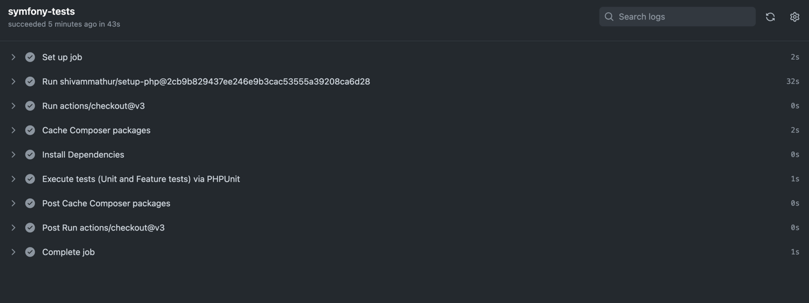
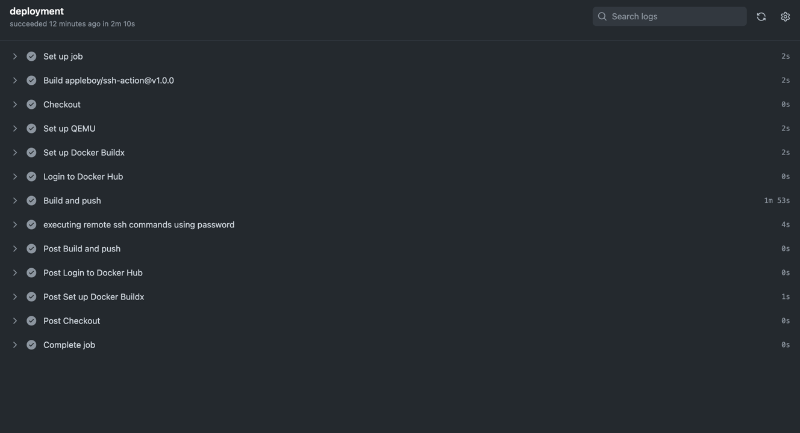
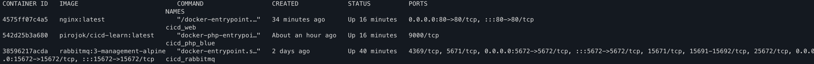

# CI CD

В качестве ci/cd я использовал `github actions`.

На пуш в `main` ветку автоматически прогоняются тесты.

```yaml
name: Symfony-tests

on:
    push:
        branches: [ "main" ]

permissions:
    contents: read

jobs:
    symfony-tests:
        runs-on: ubuntu-latest
        steps:
            #  To automatically get bug fixes and new Php versions for shivammathur/setup-php,
            # change this to (see https://github.com/shivammathur/setup-php#bookmark-versioning):
            # uses: shivammathur/setup-php@v2
            - uses: shivammathur/setup-php@2cb9b829437ee246e9b3cac53555a39208ca6d28
              with:
                  php-version: '8.2'
            - uses: actions/checkout@v3
            - name: Cache Composer packages
              id: composer-cache
              uses: actions/cache@v3
              with:
                  path: vendor
                  key: ${{ runner.os }}-php-${{ hashFiles('**/composer.lock') }}
                  restore-keys: |
                      ${{ runner.os }}-php-
            - name: Install Dependencies
              run: composer install -q --no-ansi --no-interaction --no-scripts --no-progress --prefer-dist
            - name: Execute tests (Unit and Feature tests) via PHPUnit
              run: vendor/bin/phpunit

```

Результат:



Завернул приложение в докер:

```yaml
version: "3.3"

services:
    web:
        container_name: cicd_web
        image: nginx:latest
        ports:
            - "80:80"
        volumes:
            - ./server.conf:/etc/nginx/conf.d/default.conf
        depends_on:
            - php-blue
            - php-green

    php-blue:
        container_name: cicd_php_blue
        image: pirojok/cicd-learn:latest
        depends_on:
            - rabbitmq

    php-green:
        container_name: cicd_php_green
        image: pirojok/cicd-learn:latest
        depends_on:
            - rabbitmq

    rabbitmq:
        container_name: cicd_rabbitmq
        image: rabbitmq:3-management-alpine
        ports:
            - 5672:5672
            - 15672:15672
        volumes:
            - rabbitmq_data:/var/lib/rabbitmq/

volumes:
    rabbitmq_data:
        driver:
            local

```

Деплой запускается вручную:

```yaml
name: Deployment

on:
    workflow_dispatch:

permissions:
    contents: read

jobs:
    deployment:
        runs-on: ubuntu-latest
        steps:
        -   name: Checkout
            uses: actions/checkout@v3
        -   name: Set up QEMU
            uses: docker/setup-qemu-action@v3
        -   name: Set up Docker Buildx
            uses: docker/setup-buildx-action@v3
        -   name: Login to Docker Hub
            uses: docker/login-action@v3
            with:
                username: ${{ secrets.DOCKERHUB_USERNAME }}
                password: ${{ secrets.DOCKERHUB_TOKEN }}
        -   name: Build and push
            uses: docker/build-push-action@v5
            with:
                file: .docker/php/Dockerfile
                push: true
                tags: pirojok/cicd-learn:latest
        -   name: executing remote ssh commands using password
            uses: appleboy/ssh-action@v1.0.0
            with:
                host: ${{ secrets.HOST }}
                username: ${{ secrets.USERNAME }}
                password: ${{ secrets.PASSWORD }}
                script: |
                    cd /var/www/cicd &&
                    wget https://raw.githubusercontent.com/wollkey/learn-ci-cd/main/docker-compose.yaml &&
                    wget https://raw.githubusercontent.com/wollkey/learn-ci-cd/main/.docker/nginx/server.conf &&
                    if docker ps -q -f name="cicd_web" | grep -q .; then
                        if docker ps -q -f name="cicd_php_green" | grep -q .; then
                            docker-compose up -d rabbitmq php-blue web
                            docker stop cicd_php_green
                        else
                            docker-compose up -d php-green
                            docker stop cicd_php_blue
                        fi
                    else
                        docker-compose up -d
                    fi
```

В пайплайне происходит сборка проекта и пуш в docker hub.
Затем происходит запуск контейнеров уже на сервере. В качестве сервера использовал vds.

Попытался сделать `blue green deployment`. Вышло совершенно в лоб, без версионирования.
Если запущен blue php-fpm, то запускается green, а потом blue останавливается, и наоборот.
Трафик разруливает nginx.

Конфиг nginx 
```nginx
upstream php-fpm {
    least_conn;
    server php-blue:9000;
    server php-green:9000;
}

server {
    index index.php;

    server_name localhost;

    error_log  /var/log/nginx/error.log;
    access_log /var/log/nginx/access.log;

    root /var/www/public;

    location ~* .(jpg|jpeg|gif|css|png|js|ico|html)$ {
        access_log off;
        expires max;
    }

    location / {
        try_files $uri /index.php?$query_string;
    }

    location ~ \.php$ {
        try_files $uri =404;
        fastcgi_split_path_info ^(.+\.php)(/.+)$;
        fastcgi_pass php-fpm;
        fastcgi_index index.php;
        include fastcgi_params;
        fastcgi_param SCRIPT_FILENAME $document_root$fastcgi_script_name;
        fastcgi_param PATH_INFO $fastcgi_path_info;
    }
}
```

Результат:





Для экспериментов с ci/cd выполнял всё в отдельном репозитории,
а не учебном.

В результате получился бесшовный blue green деплой,
хоть и не предназначенный для использования на реальных проектах.
