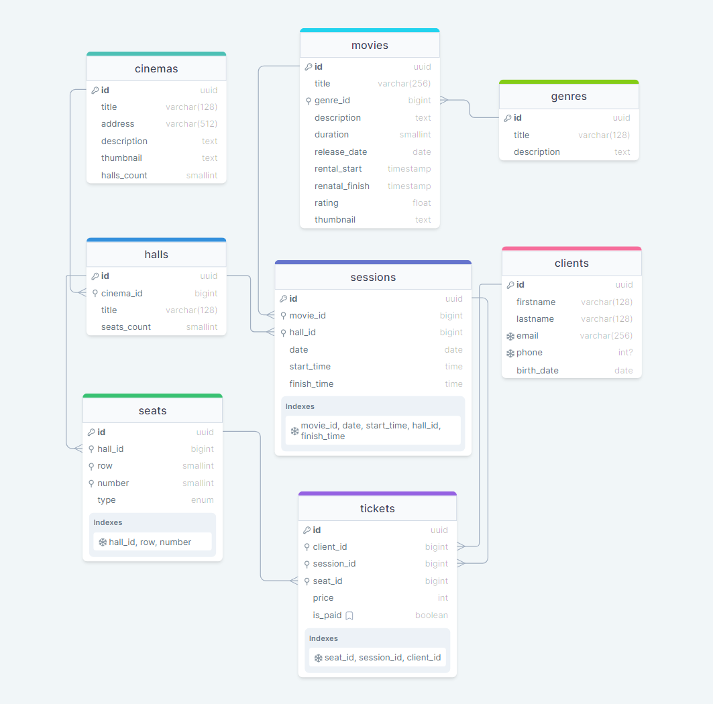

# PHP_2023 HW 7 - Cinema booking app DB structure

### How to run
1. Create `.env` from `.env.example`
2. Run `docker compose up -d`
3. Connect to DB with credentials from `.env`
4. Run queries from `query.sql`

### DB Schema
