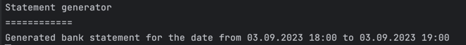
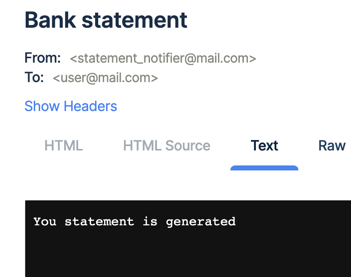

# Application

После запуска, приложение начнёт читать сообщения из кролика и выводить их на экран.
При успешном консьюме сообщения, юзер получит уведомление о готовности банковской выписки на почту.

Результат вывода сообщения в консоль:



Результат отправки уведомления о готовности выписки на почту:



# Usage

Start application:

```shell
make up
```

Send POST http request

```http request
POST http://localhost/statement/generate
Content-Type: application/json

{
  "dateFrom": "2023-09-03 18:00:00",
  "dateTo": "2023-09-03 19:00:00"
}
```
