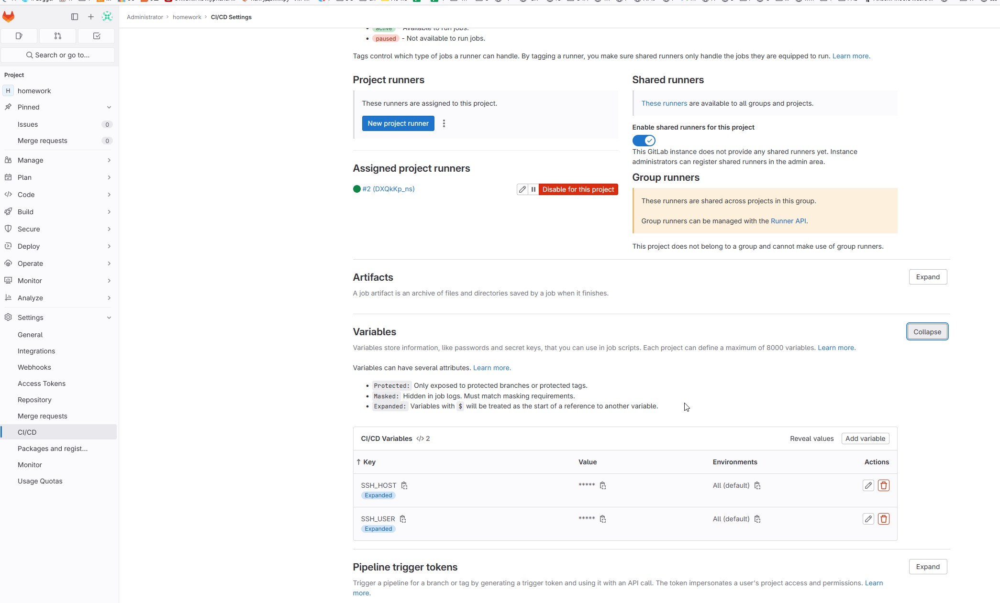
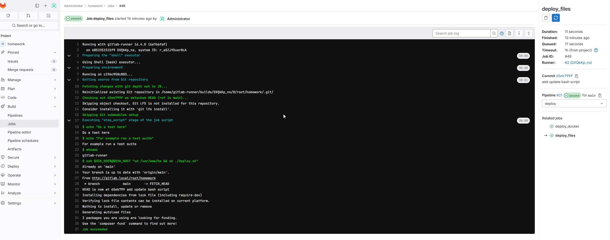
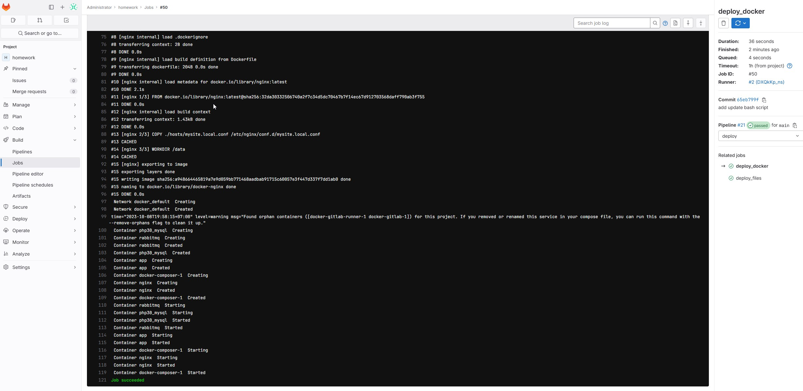

# PHP_2023

Пример ci/cd

Запустил контейнер из папки `docker`

Добавил проект с прошлого домашнего задания в локальный гит.

Добавил новый раннер executor `shell`, настроил переменные.

Написал деплой срипт, в нем две задача, первая `deploy_files` автоматически запускается при новом комите в 
ветку `main` и обнволяет файлы проекта. Результат ее работы 

Вторая `deploy_docker` задача запускается вручную и нужна для пересборки контейнеров.
! Результат ее работы 

