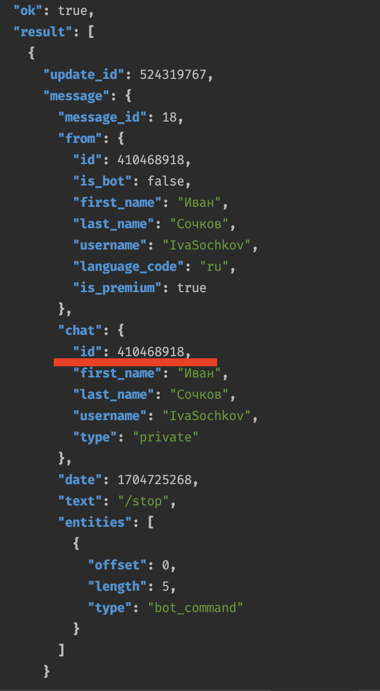
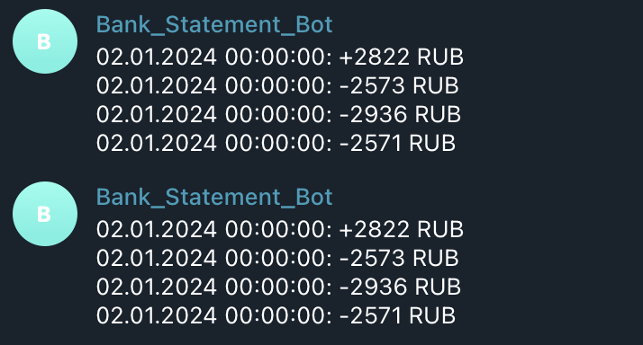

# Домашняя работа №19

## Подключение к телеграм-боту:

```
В телеграме подписываемся на бота: @OtusBankBot.
Затем берем наш chat_id:
```
```
curl -s https://api.telegram.org/bot6577760375:AAEEN1QXVU02usGSVqaoBXpgQYaRp2z4KIw/getUpdates | jq
```



## Запуск проекта

```shell
cp .env.example .env
docker-compose up -d --build
symfony server:start

bin/console doctrine:migrations:migrate
bin/console doctrine:fixtures:load
bin/console consume:start-consumer
```

## Запрос для генерации выписки:

```
POST /api/v1/bank-statements

{
    "chatId": "123456789",
    "dateFrom": "2023-10-01 00:00:00",
    "dateTo": "2023-10-05 00:00:00"
}
```

## Пример вывода в консоль:

```
Handling: O:51:"App\Application\Command\ProcessBankStatementCommand":3:{s:6:"chatId";O:29:"App\Entity\ValueObject\ChatId":1:{s:37:"App\Entity\ValueObject\ChatIdchatId";s:9:"410468918";}s:8:"dateFrom";O:8:"DateTime":3:{s:4:"date";s:26:"2024-01-02 00:00:00.000000";s:13:"timezone_type";i:3;s:8:"timezone";s:3:"UTC";}s:6:"dateTo";O:8:"DateTime":3:{s:4:"date";s:26:"2024-01-10 00:00:00.000000";s:13:"timezone_type";i:3;s:8:"timezone";s:3:"UTC";}}.
Handled: App\Application\Command\ProcessBankStatementCommand(2024-01-02T00:00:00+00:00, 2024-01-10T00:00:00+00:00).
```

## Пример отправленного сообщения в телегу:

