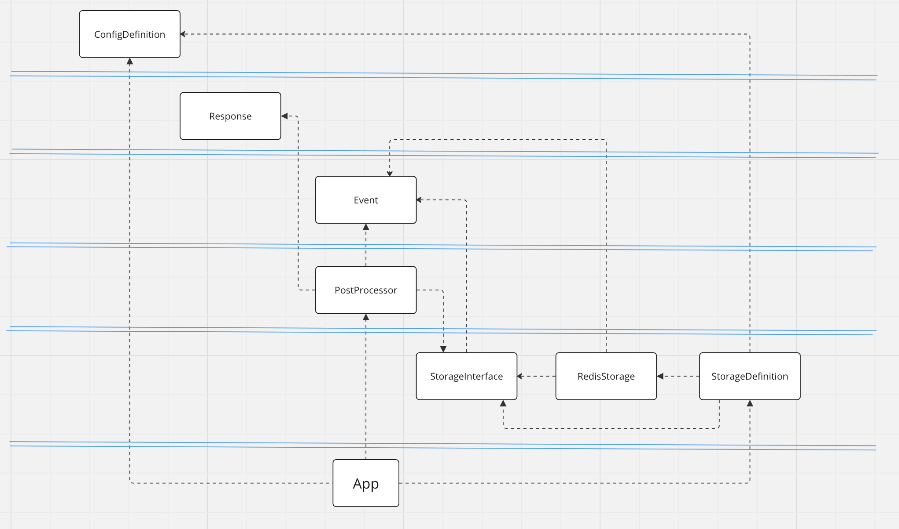
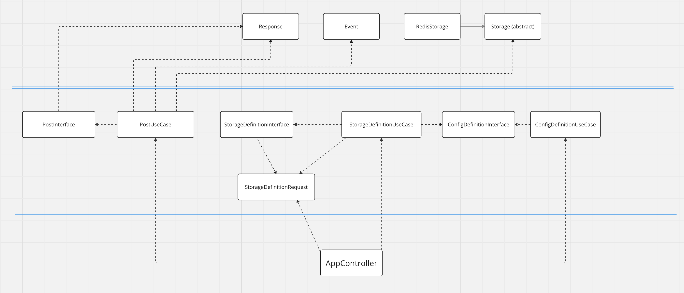

# PHP_2023 Timerkhanov Artur hw15
## Архитектура кода

--- 
### Before
> Взял работу по Редису для рефакторинга, в проекте изначально не было четких слоев.
[Проект по работе с Redis](https://github.com/otusteamedu/PHP_2023/tree/ATimerkhanov/hw12/code)
 
> Все находилось хаотично - что можно увидеть на скрине

---
### After
> Архитектуру разбил на три слоя - Infrastructure, Application, Domain.  
> Добавил DTO для передачи данных между слоями, где смог добавил интерфейсы чтобы не зависить на прямую от класса.  
> В слое Domain добавил абстрактный класс - который позволяет не зависить от коткретного хранилища. 
> И в случае чего мы можем клепать любое кол-во разных хранилищ - у которых всегда будут нужные методы.
> 

