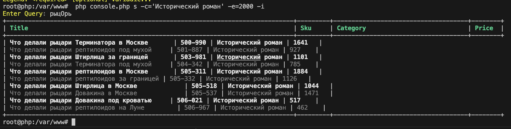

### Init Application
- cd ./app
- docker-compose up --build -d
- docker exec -it php bash
- composer install

---

### Use Application
- docker exec -it php bash
- run
```bash
   php console.php
```
- response
```bash
    App, version v0.0.1

    Commands:
    *
    Check  ch    Check connection
    Create c     Create Index
    Delete d     Delete Index
    Insert i     Parse JSON file and insert bulk data
    Search s     Search data
```
- run
```bash
    php console.php s --help
```
- response
```bash
    Command Search, version v0.0.1

    Search data

    Usage: Search [OPTIONS...] [ARGUMENTS...]

    Arguments:
    (n/a)

    Options:
    [-c|--category]     The category
    [-h|--help]         Show help
    [-i|--inStock]      Available in stock
    [-e|--maxPrice]     The maximum price
    [-s|--minPrice]     The minimum price
    [-v|--verbosity]    Verbosity level [default: 0]
    [-V|--version]      Show version

    Legend: <required> [optional] variadic...
```

---

### Example use
*Вывести все исторические романы дешевле 2000 рублей (и в наличии) по поисковому запросу "рыцОри"*
1. docker exec -it php bash
2. Create INDEX
```bash
    php console.php c
```
3. Insert Data
```bash
    php console.php i
```
4. Search Data
- Start Search
```bash
    php console.php s -c='Исторический роман' -e=2000 -i
```
- Next
```bash
    Enter Query: рыцОрь
```
- result
