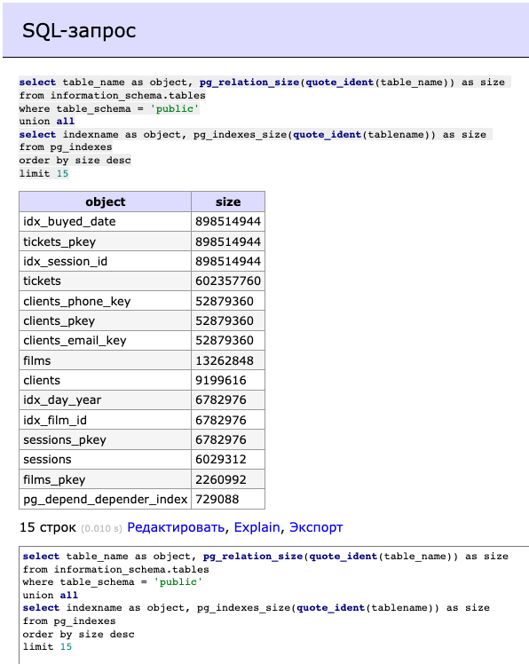

# PHP_2023

## Home work 10 
 

>1. Сначала создаем функции, для помощи генерации данных - функции файл functions.sql 
> 2. Создаем таблицы из файла ddl_cinema_system.sql 
> 3. Заполняем таблицы данными из файла 10_000_generate_data.sql или 10_000_000_generate_data.sql
> 
 

---

 

### Отсортированный список (15 значений) 
 Самых больших по размеру объектов БД (таблицы, включая индексы, сами индексы)
