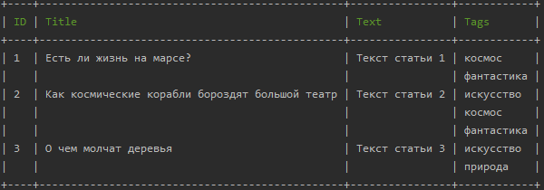

# Active Record + Lazy Load

БД простой структуры - статьи + теги, свзяь Many-to-Many через промежуточную таблицу.
Дамп БД с данными в файле database.sql.

Приложение консольное, два варианта запуска:
- список статей без тегов
- список статей с тегами

Получение списка статей без тегов:
````
docker run --rm -v ${PWD}/www:/www --env-file ${PWD}/.env  --network homework_otus-network -it cli php console.php articles:short
````


Получение списка статей с тегами:
````
docker run --rm -v ${PWD}/www:/www --env-file ${PWD}/.env  --network homework_otus-network -it cli php console.php articles:full
````


Теги подтягиваются при обращении в геттеру getTags объекта Article.
