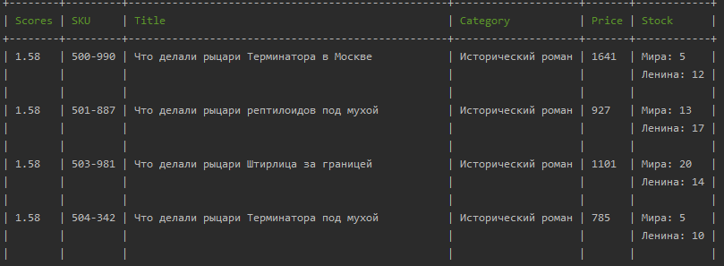

# ElasticSearch

Переделанная версия домашней работы по еластику, в соответствии с правильной архитектурой кода.
Запуск скриптов и результаты не поменялись.

Запуск PHP-CLI контейнера.
Обязательно указать --network, иначе не увидит Elastic.
````
docker run --rm -v ${PWD}/www:/www --env-file ${PWD}/.env --network homework_otus-network -it cli php console.php
````

Загрузка данных в индекс:
````
console.php load
````

Поиск:
````
console.php find
````

Пример запроса для загрузки данных:
````
docker run --rm -v ${PWD}/www:/www --env-file ${PWD}/.env --network homework_otus-network -it cli php console.php load
````

Пример запроса для поиска:
````
docker run --rm -v ${PWD}/www:/www --env-file ${PWD}/.env --network homework_otus-network -it cli php console.php find --title="рыцОри" --category="Исторический" --price="<2000" --stock=">=1"
````

Скрин ответа (начало таблицы):

