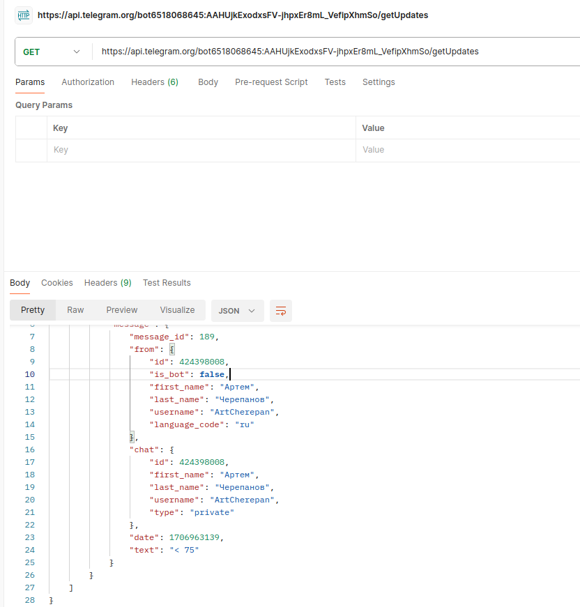
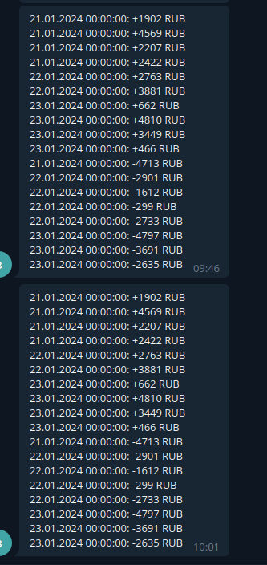

# Домашняя работа №18

## Подключение к телеграм-боту:

```
В телеграме подписываемся на бота: @amazingWelnessBot.
Затем берем наш chat_id:
```
```
curl -s https://api.telegram.org/bot6518068645:AAHUjkExodxsFV-jhpxEr8mL_VefipXhmSo/getUpdates | jq
```



## Запуск проекта

```shell
cp .env.example .env
docker-compose up -d --build
symfony server:start
```

## Подключение к бд:
```
Host: localhost
Port: 5433
User: rmq-user
Password: password
Database: rmq_db
```


```
bin/console doctrine:migrations:migrate
bin/console doctrine:fixtures:load
bin/console rabbitMQ:consumer-create
```

## Запрос для генерации выписки:

```
POST /api/v1/generate 

{
    "chatId": "123456789",
    "dateFrom": "2024-01-21 00:00:00",
    "dateTo": "2024-01-23 00:00:00"
}
```

## Пример отправленного сообщения в телегу:

