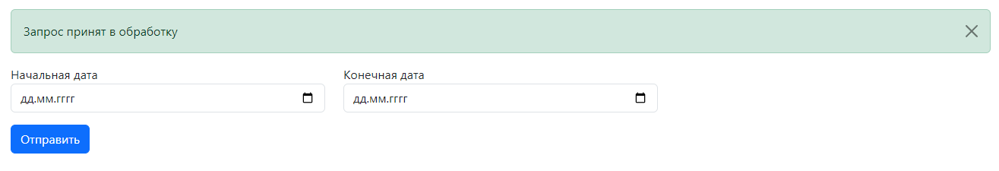
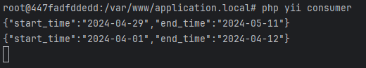

# Homework 19

1. `cd app`
2. `cp .env.example .env`
3. `docker-compose up --build -d`
4. `docker-compose exec -it consumer bash`
5. `cd /var/www/application.local`
6. `composer install`
7. `php yii consumer`
8. `Перейти в браузере по адресу` [http://application.local/](http://application.local/)

### Пример работы

