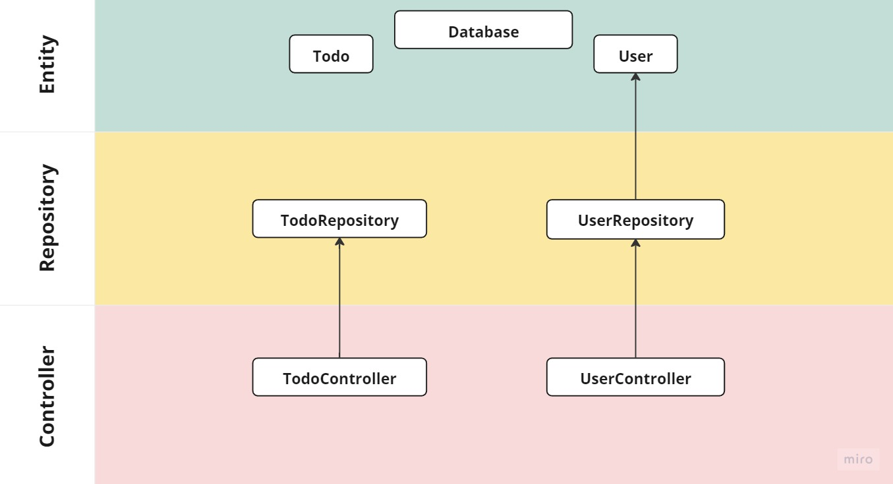
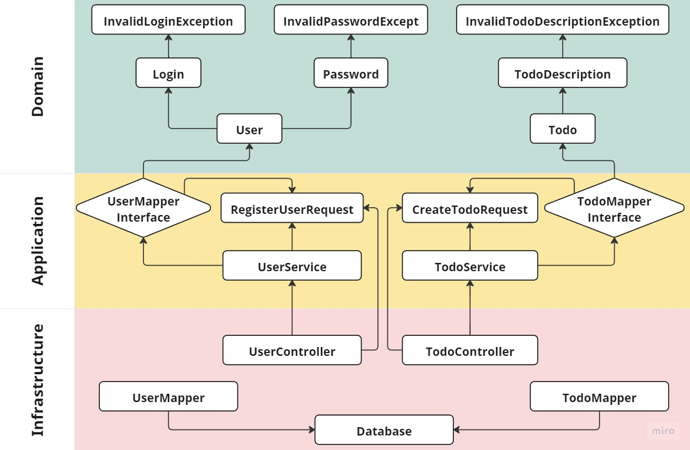

# Результаты исправления

Ссылка на код до исправления: `https://github.com/prizman2000/vl-testing/tree/develop/task2/api`

1. Были выделены слои приложения в соответствии и архитектурным паттерном **Onion architecture**.
2. Логика приложения вынесена из контроллеров так как их задача как можно быстрее *сбросить* входные данные на следующий уровень.
3. Сущность *Database* вынесена из списка моделей в слой инфраструктуры, как и мапперы, которые ей пользуются. Для доступа слоя приложения к мапперам были выделены соответствующие интерфейсы. 
4. Для логина и пароля в сущности пользователя были созданы классы типа Value Object, что позволяет указывать в правильном порядке значения с одинаковыми типами (при включении эмуляции строгой типизации), а также валижировать данные при создании данных объектов.
5. Для тел запросов были созданны классы типа Data Transfer Object для описания входных данных, увеличения читаемости и уменьшения дублирования кода.

### Диаграмма до рефактора

### Диаграмма после рефактора

___
### P.S. Исправление было произведено частично с целью отработки полученных знаний.